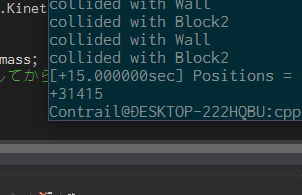

# Collision of Blocks
ブロックの衝突をシミュレーションし、円周率を計算します。  
入力として一方のブロックの質量を設定します。フォーマットとしては10^d kgとなります。  
これにより、ブロック同士及び壁との衝突回数を数え上げることにより円周率をd+1桁の精度で計算できます。  
なお、求められる桁数は理論上では無限大ですが、一方の重量を大きくすることにより、一方のブロックの速さの変化率が極めて大きくなってしまい、加速度パラメータがオーバーフローしてしまうため、現実的には限界があります。  

下の画像はd=4として計算した場合の出力結果です。  
